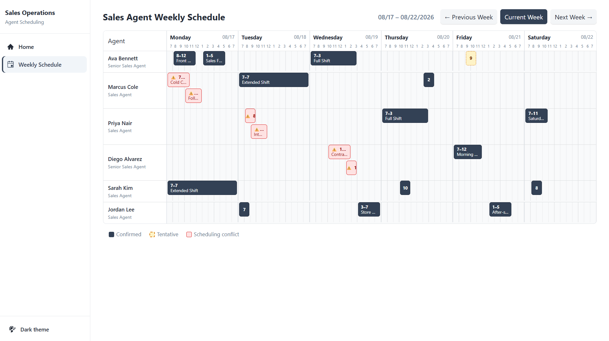
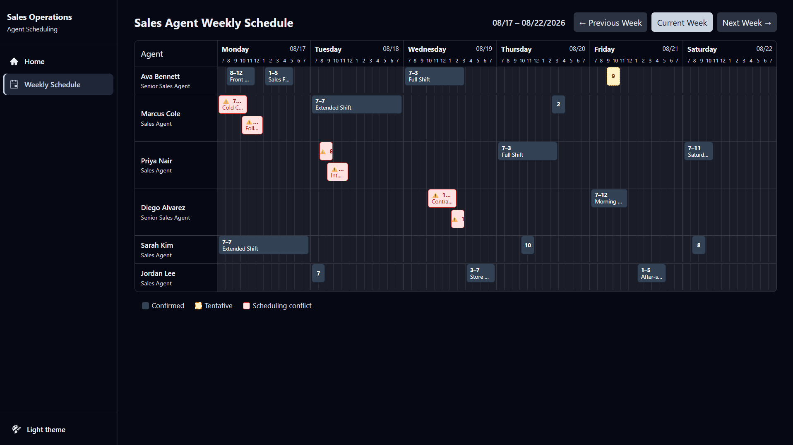

# Sales Agent Weekly Schedule

<p align="center">
  <strong>Agenda semanal de agentes de vendas desenvolvida com Blazor Web App e Telerik UI for Blazor.</strong>
</p>

<p align="center">
  
  
  
  
  
</p>

---

## Sobre o projeto

O **Sales Agent Weekly Schedule** é uma aplicação web para visualização compacta da agenda semanal de agentes de vendas.

A interface apresenta:

* uma linha para cada agente;
* visualização de segunda-feira a sábado;
* período das **7:00 AM às 7:00 PM**;
* 12 intervalos de uma hora por dia;
* compromissos posicionados de acordo com horário inicial e duração;
* identificação de conflitos e sobreposições;
* navegação entre semanas;
* informações rápidas através de tooltip;
* visualização detalhada dos compromissos.

O layout foi projetado para manter toda a agenda disponível em uma única viewport desktop, evitando rolagem horizontal da página.

---

## Preview

<p align="center">
  
</p>

<details>
<summary>Dark theme</summary>

<p align="center">
  
</p>

</details>

> A interface utiliza textos em inglês para manter consistência com a nomenclatura e o domínio da aplicação.

---

## Stack

| Tecnologia                | Uso                             |
| ------------------------- | ------------------------------- |
| **.NET 10**               | Plataforma da aplicação         |
| **Blazor Web App**        | Interface web                   |
| **Interactive Server**    | Modelo de interatividade        |
| **Telerik UI for Blazor** | Componentes e tema visual       |
| **C#**                    | Regras e lógica de apresentação |
| **Razor Components**      | Componentização da interface    |
| **CSS Grid**              | Construção da timeline semanal  |

---

## Funcionalidades

* Agenda semanal de **segunda-feira a sábado**
* Horários entre **7:00 AM e 7:00 PM**
* Uma linha independente para cada agente de vendas
* Posicionamento proporcional dos blocos por horário inicial e duração
* Navegação para:

  * semana anterior;
  * semana atual;
  * próxima semana
* Dados mockados localmente
* Variação determinística dos dados conforme a semana selecionada
* Turnos completos e parciais
* Períodos sem compromissos
* Compromissos sobrepostos
* Identificação visual de conflitos
* Diferenciação de compromissos confirmados e provisórios
* Tooltip para consulta rápida
* Janela com detalhes completos do compromisso
* Navegação por teclado nos blocos da agenda
* Interface integrada ao tema Telerik (Meridian)
* Alternância entre tema claro e escuro, mantendo a mesma paleta de status em ambos

---

## Decisão de implementação

### Por que não utilizar o `TelerikScheduler` para a timeline?

Durante a análise inicial da implementação, o `TelerikScheduler` foi considerado como solução para a agenda.

Entretanto, o layout possui uma característica bastante específica:

```text
6 dias × 12 intervalos horários
```

Todos os dias precisam permanecer visíveis simultaneamente, agrupados individualmente e sem gerar rolagem horizontal na página.

O `TelerikScheduler` é voltado para cenários tradicionais de calendário e agendamento. Adaptá-lo para reproduzir exatamente esse comportamento exigiria customizações significativas sobre templates e estilos internos do componente.

Isso aumentaria o acoplamento à estrutura interna da biblioteca e poderia resultar em CSS mais difícil de manter.

### Trade-off escolhido

A solução adotada combina componentes Telerik com uma timeline customizada:

```text
Telerik UI
   │
   ├── Tema e layout
   ├── Botões
   ├── Tooltip
   └── Janela de detalhes

Razor + CSS Grid
   │
   └── Timeline semanal customizada
```

Dessa forma, o Telerik é utilizado onde oferece valor direto, enquanto a timeline permanece sob controle completo da aplicação.

### O que faria diferente

Em uma evolução do projeto, eu revisitaria principalmente decisões relacionadas à arquitetura e escalabilidade do front-end:

* **Render mode por página.** Hoje a aplicação utiliza `InteractiveServer` globalmente através do `Routes` em `App.razor`. Eu avaliaria manter páginas sem necessidade de interatividade em Static SSR e aplicar `InteractiveServer` apenas às áreas realmente interativas, como `/schedule`, adequando também a estrutura do `TelerikRootComponent` para esse cenário.
* **Virtualização das linhas.** A implementação atual renderiza os agentes com `@foreach`, o que é adequado para os 6 agentes do cenário atual. Para conjuntos significativamente maiores, avaliaria `Virtualize<TItem>` para reduzir a quantidade de elementos mantidos no DOM.
* **Timeline reutilizável.** Extrairia a estrutura atualmente otimizada para 6 dias × 12 intervalos para um componente configurável, permitindo diferentes períodos, granularidades e, caso necessário, recursos como criação, edição e drag-and-drop.

Também reconsideraria o `TelerikScheduler` caso os requisitos evoluíssem para cenários mais próximos de um calendário tradicional. Para os requisitos atuais — seis dias simultaneamente visíveis, doze intervalos por dia e ausência de rolagem horizontal —, a timeline customizada com Razor Components e CSS Grid continua sendo a solução mais direta.

---

## Layout da agenda

A estrutura principal utiliza **CSS Grid**.

Ao invés de criar fisicamente 72 colunas:

```text
6 dias × 12 horas = 72 colunas
```

a agenda possui uma estrutura principal de apenas sete colunas:

```text
Agent | Monday | Tuesday | Wednesday | Thursday | Friday | Saturday
```

O conceito da grid principal é:

```css
grid-template-columns: 160px repeat(6, minmax(0, 1fr));
```

Cada coluna de dia possui sua própria timeline interna.

Os intervalos de horário são representados visualmente e os compromissos são posicionados utilizando porcentagens calculadas a partir do horário inicial e da duração.

Exemplo:

```text
7 AM                                         7 PM
│---------------------------------------------│

        ███████████████
        9 AM        1 PM
```

O posicionamento horizontal de cada compromisso segue conceitualmente:

```text
posição = (horário inicial - 7h) / 12
largura = duração / 12
```

Essa abordagem permite manter os seis dias fluidos dentro da largura disponível da página.

O horário inicial e final de cada compromisso é limitado (`Math.Clamp`) à janela de 7h–19h antes desse cálculo: um compromisso mockado que começasse antes das 7h ou terminasse depois das 19h continua sendo posicionado inteiramente dentro da célula do dia (e não vaza para o dia seguinte) — o texto do bloco, o tooltip e a janela de detalhes continuam mostrando o horário real, só a barra visual respeita o limite da janela de trabalho.

---

## Conflitos de horário

Compromissos sobrepostos de um mesmo agente são detectados durante a preparação dos dados para apresentação.

Quando existe uma sobreposição, os blocos são distribuídos em pequenas **lanes** dentro da linha do agente.

Exemplo:

```text
Agent

Lane 1    █████████████
Lane 2          █████████████
```

A distribuição é calculada em C#, separadamente dos componentes Razor.

Além da diferença visual, conflitos possuem indicadores adicionais para que o estado não seja comunicado exclusivamente através de cores.

A interface utiliza estados visuais de **Confirmed**, **Tentative** e **Scheduling conflict** para demonstrar diferentes cenários da agenda e comunicar conflitos sem depender apenas de cor. Sobreposições/conflitos de horário são o cenário exigido pelo requisito de status visual; `Confirmed` e `Tentative` são uma decisão de modelagem para deixar a agenda mais realista e ilustrar melhor esse mesmo requisito.

---

## Acessibilidade

Os blocos da agenda podem ser utilizados tanto com mouse quanto com teclado.

Entre os recursos utilizados estão:

* `tabindex`;
* identificação semântica dos elementos interativos;
* acionamento por `Enter`;
* acionamento por `Space`;
* tooltip com informações resumidas;
* janela com detalhes completos;
* indicadores textuais e visuais para diferentes estados.

Compromissos provisórios e conflitos possuem indicadores adicionais além da diferenciação por cor.

---

## Arquitetura

O projeto mantém as regras de apresentação separadas dos componentes Razor.

```text
Models/
├── SalesAgent.cs
├── ScheduleEntry.cs
├── ShiftKind.cs
├── PositionedBlock.cs
└── ScheduleTimes.cs

Services/
├── IScheduleService.cs
├── MockScheduleService.cs
├── ScheduleLayoutBuilder.cs
└── ThemeService.cs

Components/
├── Layout/
│   ├── MainLayout.razor
│   ├── TelerikLayout.razor
│   ├── NavMenu.razor
│   ├── ThemeStylesheet.razor
│   └── ReconnectModal.razor
├── Pages/
│   ├── Home.razor
│   └── Schedule.razor
└── Schedule/
    ├── ScheduleHeader.razor
    ├── AgentRow.razor
    ├── ScheduleBlock.razor
    ├── WeeklySchedule.razor
    └── AppointmentDialog.razor

wwwroot/
└── css/
    ├── schedule-dialog.css
    └── kendo-theme-meridian-dark.css

docs/
└── screenshots/
    ├── sales-agent-weekly-schedule-light.png
    └── sales-agent-weekly-schedule-dark.png
```

### Separação de responsabilidades

**Models**

Representam agentes, compromissos, estados e informações necessárias para a agenda.

**Services**

Responsáveis pelos dados mockados e pelos cálculos de posicionamento, conflitos e sobreposições.

**Components**

Responsáveis pela apresentação e interação da interface. O CSS específico da agenda vive em um único arquivo isolado, `Schedule.razor.css`, escopado pelo Blazor à página `/schedule`: por padrão esse escopo cobre apenas o markup escrito diretamente nela, então as regras que estilizam o grid, as linhas e os blocos — renderizados pelos componentes filhos `WeeklySchedule`, `AgentRow`, `ScheduleHeader` e `ScheduleBlock`, que não têm CSS próprio — usam o combinador `::deep` para alcançar esse markup descendente, permanecendo escopadas à página em vez de vazar globalmente. A única exceção é `wwwroot/css/schedule-dialog.css`: o `TelerikWindow` é renderizado fora da árvore de componentes da página (via portal do `TelerikRootComponent`), então o isolamento de CSS do Blazor não o alcança de forma alguma — por isso esse arquivo é carregado manualmente pela página `/schedule`, mas ainda assim restrito a classes próprias (`.appointment-dialog`, `.status-pill`, etc.), sem sobrescrever seletores globais do Telerik.

**Pages**

Controla o estado da semana selecionada e compõe os componentes da agenda.

---

## Dados mockados

A aplicação utiliza dados locais para manter o foco na implementação da interface.

Não existem dependências de:

* API externa;
* banco de dados;
* autenticação;
* serviços externos.

Os dados são gerados de forma determinística a partir da semana selecionada.

Isso permite que:

```text
Previous Week
Current Week
Next Week
```

apresentem agendas diferentes sem necessidade de backend ou persistência.

Os dados incluem diferentes cenários para demonstrar o comportamento da interface:

* turnos parciais;
* turnos completos;
* gaps entre compromissos;
* dias sem compromissos;
* compromissos provisórios;
* conflitos de horário.

A aplicação contém **6 agentes** e, em cada padrão semanal (Previous/Current/Next Week), entre **15 e 26 blocos** de agenda — acima do mínimo de 5 agentes e 12 blocos exigido. O padrão da semana atual inclui ainda dois cenários extras: um compromisso que começa antes das 7h e termina depois das 19h (testando o recorte visual na janela de horário) e um dia com 4 compromissos consecutivos, sem gaps, cobrindo as 12 horas inteiras.

---

## Executando o projeto

### Pré-requisitos

Para executar o projeto é necessário possuir:

* [.NET 10 SDK](https://dotnet.microsoft.com/)
* Conta Telerik
* Trial ou licença válida do **Telerik UI for Blazor**

### Clonar o repositório

```bash
git clone https://github.com/barbosamg/sales-agent-weekly-schedule.git
```

Acesse o diretório:

```bash
cd sales-agent-weekly-schedule
```

### Restaurar dependências

```bash
dotnet restore
```

### Compilar

```bash
dotnet build
```

### Executar

```bash
dotnet run
```

A URL da aplicação será exibida no terminal.

Depois de acessar a aplicação, utilize a navegação para abrir:

```text
Schedule
```

---

## Telerik UI for Blazor

O projeto foi criado com o scaffold oficial via **Telerik CLI**:

```bash
dotnet tool install -g Telerik.CLI --source https://api.nuget.org/v3/index.json
telerik login
telerik create blazor
```

* `telerik login` autentica a conta Telerik pelo navegador.
* `telerik create blazor` gera o projeto já com `AddTelerikBlazor()`, tema **Meridian** e as referências de pacote necessárias — foi assim que este repositório foi originado.

### Nota sobre licenciamento

Restauração dos pacotes e ativação da licença são processos independentes:

* Os pacotes `Telerik.UI.for.Blazor` utilizados pelo projeto podem ser restaurados diretamente do NuGet público (`dotnet restore`/`dotnet build`), sem necessidade de configurar um feed privado.
* Para utilizar o Telerik UI for Blazor é necessário possuir uma licença Trial ou comercial válida configurada localmente. A conta é autenticada com `telerik login`; a licença é obtida ou atualizada com:

  ```bash
  telerik license get-key
  ```

* No Windows, o arquivo de licença fica em `%AppData%\Telerik\telerik-license.txt`, fora do diretório do projeto.
* Nenhuma license key, API key, token ou credencial é versionada neste repositório.

---

## Navegação

A estrutura de navegação fornecida pelo scaffold Telerik (`NavMenu.razor`, sidebar com `NavLink`) foi preservada como base.

A entrada **Weekly Schedule** foi adicionada a essa navegação existente para disponibilizar a página da agenda, ao lado da Home já presente no scaffold, mantendo o layout e a identidade visual do tema Telerik selecionado.

A customização foi mantida propositalmente pequena para preservar a identidade visual dos componentes Telerik.

---

## Responsividade

O principal alvo da interface é uma viewport desktop de:

```text
1920 × 1080
```

Toda a agenda foi estruturada para permanecer dentro da largura disponível sem gerar rolagem horizontal na página.

As colunas dos dias utilizam unidades flexíveis:

```css
minmax(0, 1fr)
```

evitando que conteúdos internos forcem o crescimento da grid além da viewport.

A ausência de rolagem horizontal foi validada em **1920 × 1080**, resolução principal utilizada no screenshot, e adicionalmente em **1366 × 768**, uma resolução desktop comum.

---

## Limitações conhecidas

Este projeto possui foco na experiência de visualização e interação da agenda.

Algumas funcionalidades de um sistema completo não fazem parte do escopo atual:

* os dados não possuem persistência;
* não existe integração com API;
* não existe autenticação;
* compromissos não podem ser criados ou editados;
* a navegação entre semanas utiliza dados mockados;
* o algoritmo de conflitos atende aos cenários apresentados pela aplicação e não pretende substituir um sistema completo de planejamento de recursos;
* a experiência foi desenvolvida principalmente para desktop.

Em uma aplicação de produção, responsabilidades como persistência, autenticação e gerenciamento dos compromissos poderiam ser disponibilizadas através de uma API e banco de dados.

---

## Uso de Inteligência Artificial

Ferramentas de IA, incluindo o **Claude Code** (Anthropic), foram utilizadas como apoio durante o desenvolvimento deste projeto.

O uso de IA auxiliou principalmente em:

* planejamento da implementação;
* revisão de arquitetura;
* geração e revisão de código;
* análise de alternativas de layout;
* revisão de CSS;
* componentização;
* documentação;
* análise de possíveis edge cases.

As decisões técnicas, integrações, validação do comportamento e resultado final foram revisados durante o desenvolvimento.

---

<p align="center">
  <strong>Sales Agent Weekly Schedule</strong><br />
  Blazor Web App · Telerik UI for Blazor · .NET 10
</p>
